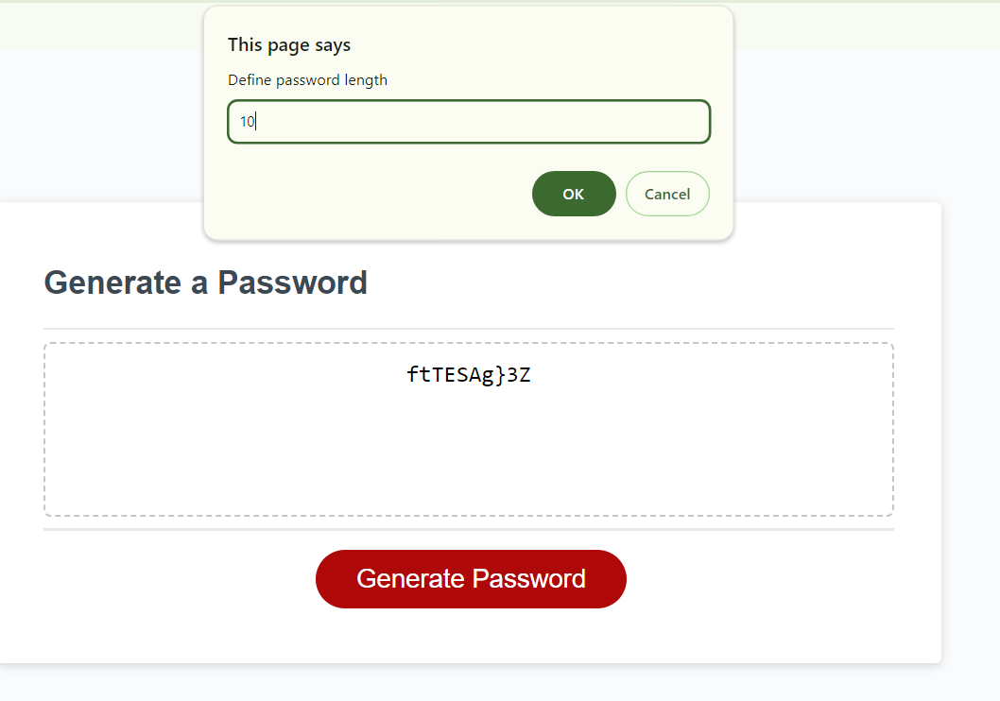

# Hansal's Password Generator

## Description

This project employs javascript alongside a basic HTML/CSS UI to create a random password, using length and character inputs from the end user.

The application will ask the user a series of prompts for password criteria, including number of character types and length. If the length is smaller than the sum of the character requirements then the application will first make the password with the sum of the characters and then truncate it to match the password length requirement. If the password length requirement is larger than the sum of the character requirements then the application will add random characters to the returned password.

The starter code is take from EdX FE Bootcamp fifth challenge's description. Please view the credits section to review the sources I used in this project.

## ACs

The application must:

* Generate a password when the button is clicked.

* Present a series of prompts for password criteria:

* Length of password:

* * At least 8 characters but no more than 128.

* Character types:

* * Lowercase

* * Uppercase

* * Numeric

* * Special characters ($@%&*, etc.)

Code should validate for each input and at least one character type should be selected.

Once all prompts are answered, the password should be generated and displayed in an alert or written to the page.

## Link to published site
https://09hanvaik.github.io/PasswordGenerator/

## Screenshot of site

## Installation

No installation steps required.

## Credits

I have used the following sites in my project as either and inspiration or to overcome a hurdle:
* Skills for Life/EdX FE bootcamp course 2023/24.
* Javascript documentation: https://developer.mozilla.org/en-US/docs/Web/JavaScript/
* Not a number function: https://www.w3schools.com/jsref/jsref_isnan.asp
* How to restart a function https://stackoverflow.com/questions/2940862/javascript-how-to-restart-a-function-from-inside-it
* Special characters: https://owasp.org/www-community/password-special-characters
* Prompt default options: https://javascript.info/alert-prompt-confirm
* Random item from array: 
* * https://www.w3resource.com/javascript-exercises/javascript-array-exercise-35.php
* * https://www.w3schools.com/js/tryit.asp?filename=tryjs_array_sort_random
* Array to string without commas, using join method:
* * https://herewecode.io/blog/array-to-string-without-commas-javascript/
* * https://www.w3schools.com/jsref/jsref_join.asp
* Join 2 or more arrays: https://www.w3schools.com/jsref/jsref_concat_array.asp